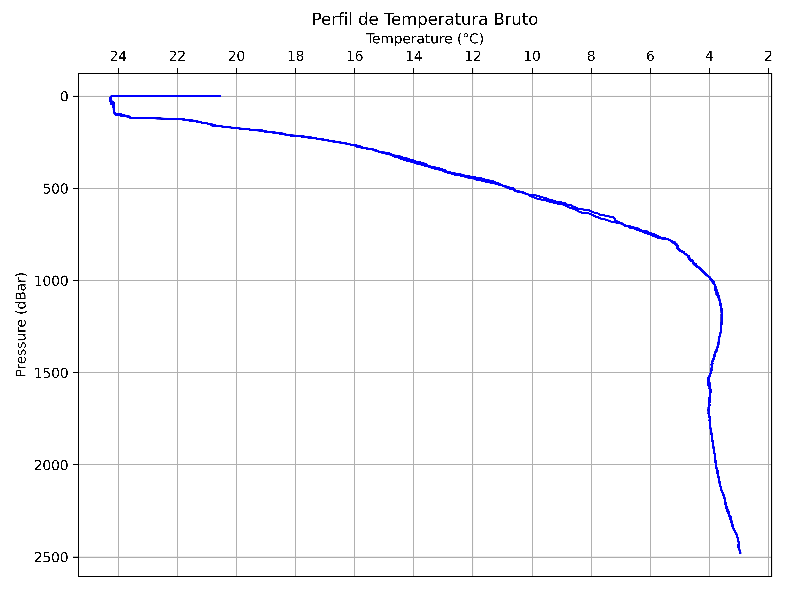
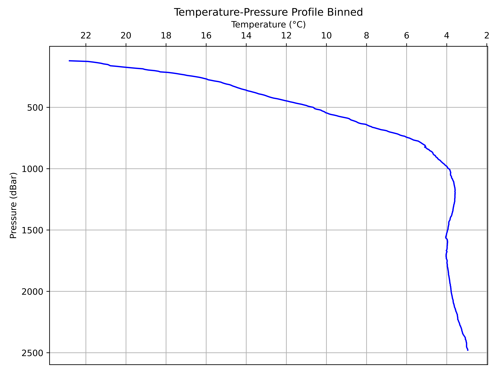
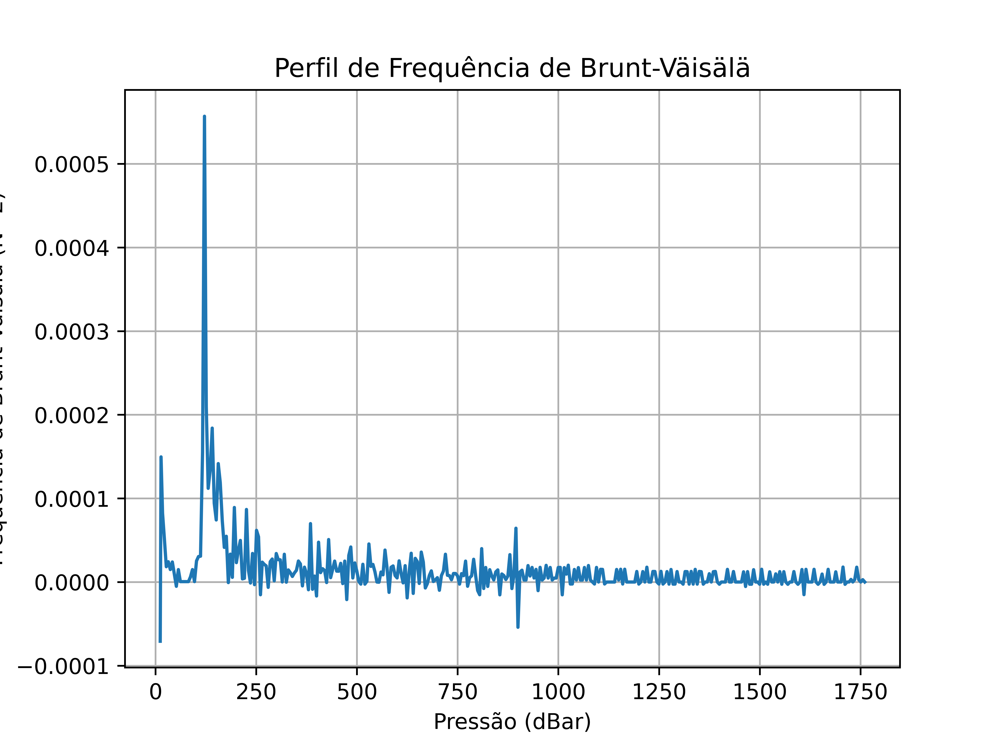

<h1 align="center"> CTD Processing </h1>


# Descrição
Este é um projeto desenvolvido por Rafael S. Bittencourt como inciação científica do Laboratório de Dinâmica Oceânica.
O objetivo do projeto é uma rotina em Python para o pré-processamento de dados de CTD.

# Funcionalidades
A rotina possui diversas funções para pré-processar os dados de CTD:
 - normalizar os separadores dos dados;
 - seaparar o downcast do aparelho de CTD;
 - retirar spikes seguindo o método 3-sigma;
 - retirar loops de pressão;
 - retirar dados medidos acima da coluna d'água;
 - aplicar um filtro passa-baixa;
 - binagem dos dados.

# Acesso à rotina
Para utilizar a rotina só é preciso que baixe o arquivo python da versão mais recente disponível e altere os parãmetros pessoais do código: 
```Python
data = pd.read_csv('path_do_arquivo', delimiter='delimitador do seu arquivo', index_col=False)
```
Certifique-se que as colunas de pressão, temperatura e salinidade tenham o nome 'pressure', 'temperature' e 'salinity' respectivamente.
É necessário também alterar o path para o salvamento dos novos arquivos gerados, tanto os novos arquivos .csv quanto as imagens dos gráficos em .png:
```Python
plt.savefig("nome_do_arquivo.png", format='png', dpi=900, transparent=False)
data_processada.to_csv('path_mais_nome_do_arquivo.csv')
binado.to_csv('path_mais_nome_do_arquivo.csv')
```

# Exemplos
Aqui está o exemplo de um arquivo de dados de CTD sem ter nenhum tipo de pré-processamento:



Podemos perceber diversos ruídos e laços de pressão, bem como dados indesejados acima da coluna d'água. Após o processamento utilizando a rotina, este é o resultado gerado para o mesmo arquivo de dados:



<h1 align="center"> Internal Waves </h1>


# Descrição
Projeto para calcular a frequência de Brunt-vaisalla para ser usado na identificação de ondas internas.
É utilizado o toolbox GSW (Gibbs SeaWater) para calcular a salinidade absoluta, temperatura conservativa e por fim a frequência de flutuabilidade.

O código consiste de três funções: bruntvaisala, plotvaisala e timecounter

- bruntvaisala: calcula a salinidade absoluta a partir da salinidade prática, temperatura conservativa a partir da salinidade absoluta e temperatura in situ, retorna uma tupla com N2 e pressão;
- plotvaisala: plota o gráfico da frequência de flutuabilidade (N2) em função da pressão;
- timecounter: executa todas as funções cronometrando seu tempo de resposta.

# Exemplo
Exemplo abaixo da imagem gerada depois de todas as funções serem executadas:


